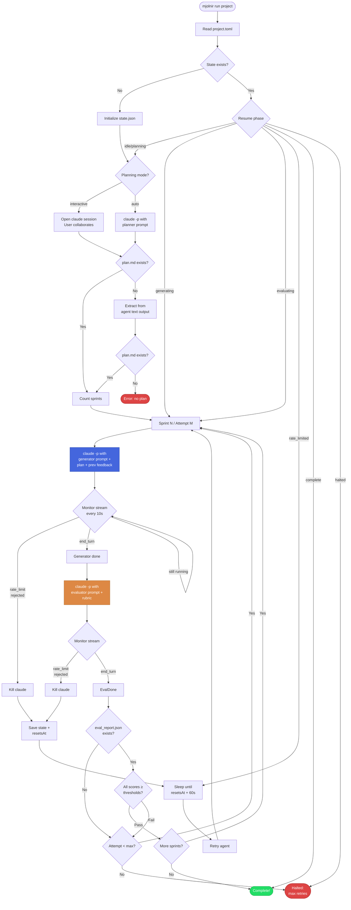

# Mjolnir — Autonomous Harness Flow

```mermaid
flowchart TD
    Start([mjolnir run project]) --> ReadConfig[Read project.toml]
    ReadConfig --> CheckState{State exists?}

    CheckState -->|No| InitState[Initialize state.json]
    CheckState -->|Yes| ResumePhase{Resume phase}
    InitState --> PlanMode

    ResumePhase -->|idle/planning| PlanMode
    ResumePhase -->|generating| GenLoop
    ResumePhase -->|evaluating| GenLoop
    ResumePhase -->|rate_limited| WaitRL
    ResumePhase -->|complete| Done
    ResumePhase -->|halted| Halted

    PlanMode{Planning mode?}
    PlanMode -->|interactive| InteractivePlan[Open claude session<br/>User collaborates]
    PlanMode -->|auto| AutoPlan[claude -p with<br/>planner prompt]

    InteractivePlan --> CheckPlan
    AutoPlan --> CheckPlan{plan.md exists?}
    CheckPlan -->|Yes| CountSprints[Count sprints]
    CheckPlan -->|No| FallbackPlan[Extract from<br/>agent text output]
    FallbackPlan --> CheckPlan2{plan.md exists?}
    CheckPlan2 -->|Yes| CountSprints
    CheckPlan2 -->|No| Error([Error: no plan])

    CountSprints --> GenLoop

    GenLoop[Sprint N / Attempt M] --> Generator
    Generator[claude -p with<br/>generator prompt +<br/>plan + prev feedback] --> MonitorGen

    MonitorGen{Monitor stream<br/>every 10s}
    MonitorGen -->|rate_limit<br/>rejected| KillGen[Kill claude] --> RLHandler
    MonitorGen -->|end_turn| GenDone[Generator done]
    MonitorGen -->|still running| MonitorGen

    GenDone --> Evaluator
    Evaluator[claude -p with<br/>evaluator prompt +<br/>rubric] --> MonitorEval

    MonitorEval{Monitor stream}
    MonitorEval -->|rate_limit<br/>rejected| KillEval[Kill claude] --> RLHandler
    MonitorEval -->|end_turn| EvalDone

    EvalDone --> CheckEval{eval_report.json<br/>exists?}
    CheckEval -->|No| RetryCheck
    CheckEval -->|Yes| Threshold{All scores ≥<br/>thresholds?}

    Threshold -->|Pass| NextSprint{More sprints?}
    Threshold -->|Fail| RetryCheck

    RetryCheck{Attempt < max?}
    RetryCheck -->|Yes| GenLoop
    RetryCheck -->|No| Halted([Halted:<br/>max retries])

    NextSprint -->|Yes| GenLoop
    NextSprint -->|No| Done([Complete!])

    RLHandler[Save state +<br/>resetsAt] --> WaitRL[Sleep until<br/>resetsAt + 60s] --> ResumeAgent[Retry agent]
    ResumeAgent --> GenLoop

    style Done fill:#2d6,stroke:#1a4,color:#fff
    style Halted fill:#d44,stroke:#a22,color:#fff
    style Error fill:#d44,stroke:#a22,color:#fff
    style Generator fill:#46d,stroke:#24a,color:#fff
    style Evaluator fill:#d84,stroke:#a62,color:#fff
```
