# Mjolnir — Autonomous Harness Flow

```mermaid
flowchart TD
    Start(["<b>mjolnir run project</b><br/><i>bash: mjolnir CLI</i>"]) --> ReadConfig["<b>Read project.toml</b><br/><i>bash → python3 tomllib</i><br/>Parses config keys via read_config()"]
    ReadConfig --> CheckState{"<b>state.json exists?</b><br/><i>bash: checks file</i>"}

    CheckState -->|No| InitState["<b>Initialize state.json</b><br/><i>python3: lib/state.py init</i><br/>Creates default state with phase=idle"]
    CheckState -->|Yes| ResumePhase{"<b>Resume from phase</b><br/><i>python3: lib/state.py</i><br/>Reads phase from state.json"}
    InitState --> PlanMode

    ResumePhase -->|idle/planning| PlanMode
    ResumePhase -->|generating| GenLoop
    ResumePhase -->|evaluating| GenLoop
    ResumePhase -->|rate_limited| WaitRL
    ResumePhase -->|complete| Done
    ResumePhase -->|halted| Halted

    PlanMode{"<b>Planning mode?</b><br/><i>bash: $PLANNING_MODE</i><br/>from env or project.toml"}
    PlanMode -->|interactive| InteractivePlan["<b>Interactive Planning</b><br/><i>claude -p → claude --resume</i><br/>System prompt: <b>prompts/planner.md</b><br/>User prompt: project.toml + sprint limit<br/>User collaborates in live TTY session"]
    PlanMode -->|auto| AutoPlan["<b>Auto Planning</b><br/><i>bash → run_agent 'planner'</i><br/>claude -p --stream-json --verbose<br/>System prompt: <b>prompts/planner.md</b><br/>User prompt: project.toml + sprint limit<br/>Pipe: <i>python3: lib/parse_stream.py --stream</i>"]

    InteractivePlan --> CheckPlan
    AutoPlan --> CheckPlan{"<b>plan.md exists?</b><br/><i>bash: file check in WORK_DIR</i>"}
    CheckPlan -->|Yes| CountSprints["<b>Count sprints</b><br/><i>bash: grep -cE</i><br/>Counts '## Sprint N' headings<br/>Caps to max_sprints if set"]
    CheckPlan -->|No| FallbackPlan["<b>Extract from agent output</b><br/><i>bash: cp .last_agent_output → plan.md</i>"]
    FallbackPlan --> CheckPlan2{"<b>plan.md exists?</b><br/><i>bash: file check</i>"}
    CheckPlan2 -->|Yes| CountSprints
    CheckPlan2 -->|No| Error(["<b>Error: no plan</b><br/><i>python3: lib/state.py transition error</i>"])

    CountSprints --> GenLoop

    GenLoop["<b>Sprint N / Attempt M</b><br/><i>bash: while loop</i><br/>state.py transition generating"] --> Generator
    Generator["<b>Generator Agent</b><br/><i>bash → run_agent 'generator'</i><br/>claude -p --stream-json --verbose<br/>--dangerously-skip-permissions<br/>System prompt: <b>prompts/generator.md</b><br/>User prompt: plan.md + sprint N<br/>+ rubric.md + prev eval feedback<br/>Pipe: <i>python3: lib/parse_stream.py --stream</i><br/>Raw stream: <i>bash tee → .raw_stream_generator.jsonl</i>"] --> MonitorGen

    MonitorGen{"<b>Monitor stream every 10s</b><br/><i>bash: while kill -0 + grep</i><br/>Checks result_file for events<br/>+ raw stream for end_turn"}
    MonitorGen -->|"rate_limit<br/>rejected"| KillGen["<b>Kill claude process</b><br/><i>bash: kill $pipeline_pid</i>"] --> RLHandler
    MonitorGen -->|end_turn| GenDone["<b>Generator done</b><br/><i>bash: parse done event</i><br/>python3 inline: extract result JSON<br/>python3: lib/state.py add_cost"]
    MonitorGen -->|still running| MonitorGen

    GenDone --> Evaluator
    Evaluator["<b>Evaluator Agent</b><br/><i>bash → run_agent 'evaluator'</i><br/>claude -p --stream-json --verbose<br/>--dangerously-skip-permissions<br/>System prompt: <b>prompts/evaluator.md</b><br/>User prompt: plan.md + sprint N<br/>+ rubric.md + attempt number<br/>Evaluator uses Playwright CLI for UI testing<br/>Pipe: <i>python3: lib/parse_stream.py --stream</i>"] --> MonitorEval

    MonitorEval{"<b>Monitor stream</b><br/><i>bash: same grep loop</i>"}
    MonitorEval -->|"rate_limit<br/>rejected"| KillEval["<b>Kill claude</b><br/><i>bash: kill</i>"] --> RLHandler
    MonitorEval -->|end_turn| EvalDone["<b>Evaluator done</b><br/><i>bash → python3 inline</i>"]

    EvalDone --> CheckEval{"<b>eval_report.json exists?</b><br/><i>bash: file check in sprint dir</i>"}
    CheckEval -->|No| RetryCheck
    CheckEval -->|Yes| Threshold{"<b>All scores ≥ thresholds?</b><br/><i>python3 inline: check_thresholds()</i><br/>Reads eval_report.json scores<br/>vs project.toml thresholds"}

    Threshold -->|Pass| NextSprint{"<b>More sprints?</b><br/><i>bash: sprint ≤ total</i>"}
    Threshold -->|Fail| RetryCheck

    RetryCheck{"<b>Attempt < max?</b><br/><i>bash: comparison</i>"}
    RetryCheck -->|Yes| GenLoop
    RetryCheck -->|No| Halted(["<b>Halted: max retries</b><br/><i>python3: lib/state.py transition halted</i><br/><i>python3: lib/notify.py error</i>"])

    NextSprint -->|Yes| GenLoop
    NextSprint -->|No| Done(["<b>Complete!</b><br/><i>python3: lib/state.py transition complete</i><br/><i>python3: lib/notify.py success</i>"])

    RLHandler["<b>Save state + resetsAt</b><br/><i>python3: lib/state.py enter_rate_limit</i>"] --> WaitRL["<b>Sleep until resetsAt + 60s</b><br/><i>bash: sleep</i>"] --> ResumeAgent["<b>Retry agent</b><br/><i>bash: recursive run_agent()</i><br/><i>python3: lib/state.py exit_rate_limit</i>"]
    ResumeAgent --> GenLoop

    style Done fill:#2d6,stroke:#1a4,color:#fff
    style Halted fill:#d44,stroke:#a22,color:#fff
    style Error fill:#d44,stroke:#a22,color:#fff
    style Generator fill:#46d,stroke:#24a,color:#fff
    style Evaluator fill:#d84,stroke:#a62,color:#fff
    style InteractivePlan fill:#46d,stroke:#24a,color:#fff
    style AutoPlan fill:#46d,stroke:#24a,color:#fff
```

## Runtime Legend

| Runtime | Used For |
|---------|----------|
| **bash** (mjolnir.sh) | Orchestration loop, process management, file checks, `grep`/`sleep`/`kill` |
| **python3 inline** | TOML parsing (`tomllib`), JSON field reads, threshold checks (heredoc scripts in bash) |
| **python3: lib/state.py** | Atomic state machine — file-locked read/modify/write of `state.json` |
| **python3: lib/parse_stream.py** | JSONL stream parser — reads `claude -p` output, detects rate limits, yields events |
| **python3: lib/notify.py** | Push notifications via ntfy.sh (background, non-blocking) |
| **claude -p** | Claude Code CLI in headless mode — runs planner, generator, evaluator agents |
| **claude** (interactive) | Claude Code CLI with TTY — used for interactive planning mode |

## Prompt/Instruction Flow

| Agent | System Prompt | User Prompt Contents |
|-------|--------------|---------------------|
| **Planner** | `prompts/planner.md` | `project.toml` contents + max_sprints constraint |
| **Generator** | `prompts/generator.md` | `plan.md` + sprint number + `rubric.md` + previous `eval_report.json` (if retry) |
| **Evaluator** | `prompts/evaluator.md` | `plan.md` + sprint number + attempt number + `rubric.md` |
